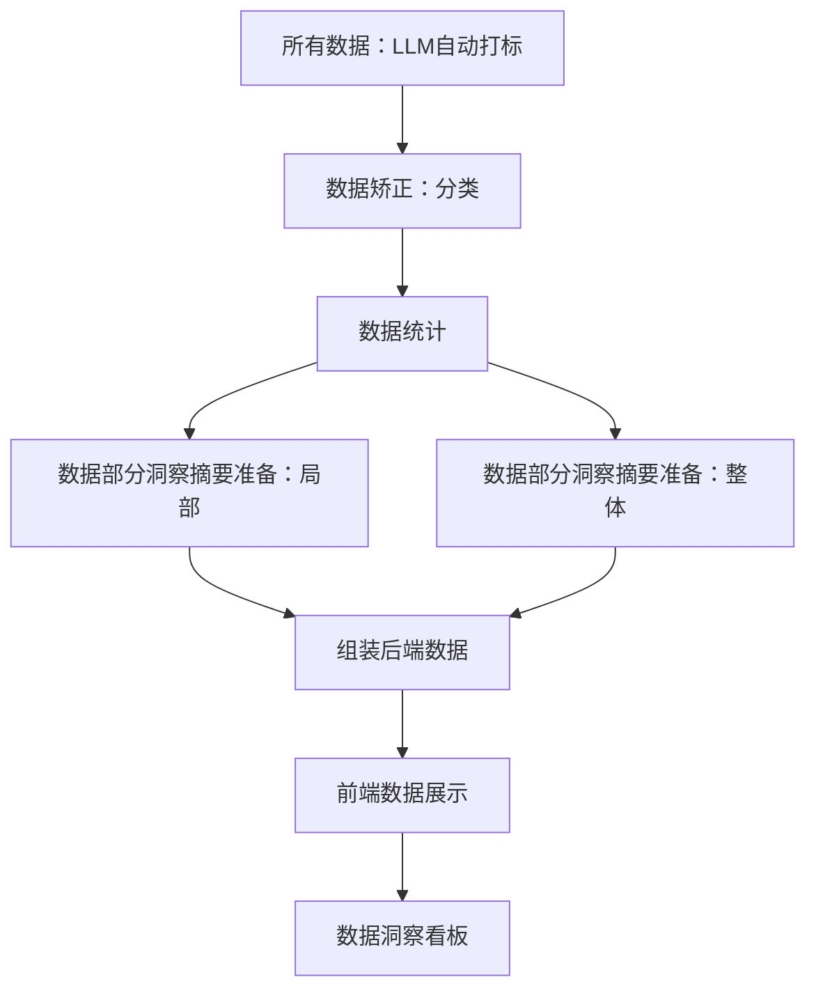

# 数据分析的版块
- 分析模块：用户画像、使用场景、购买动机、商品卖点、商品不足点等
- 技术模块：分析样本、全量打标、报表生成
    - 分析样本：让大模型对每个评论进行标签，将这些标签而后进行聚类后生成标签的样本库；
    - 全量打标：无需将所有的商品评论信息通过大模型进行分析来获取评论标签，仅需要基于评论原文与向量数据库，实时召回评论标签即可生成高质量标签，去除了对大模型的依赖，极大地降低了评论数据分析的成本。
    - 标签管理：参考CTQ/客户旅程模型，CTQ模型，可以是根据客户需求，拆解质量驱动因素，再往下拆解指标要求；标签分类：场景，行为，地点，质量，功能，结构，服务，价格，购买次数，身份
    - 报表生成：统计+总结+摘要

## 用户画像：
- 画像维度：
    - 性别
    - 职业
    - 场景
    - 购买动机
    - 购买频次：首次购买、复购用户、高频用户
    - 价格敏感度：对价格的关注程度和敏感程度
    - 技术熟悉度：对产品技术细节的了解程度
## 产品分析
- 产品维度：
    - 产品质量
    - 产品功能
    - 产品价格
    - 售后体验
    - 物流体验
## 竞品对比分析

# 数据洞察看板结构
- 总体概览:六个指标块一栏
    - 总评论数：指标,data.total_review
    - 总话题数：指标,data.product_topics.total_stats.total_count
    - 话题好评占比：指标，data.product_topics.total_stats.good_rate
    - 话题差评占比：指标，data.product_topics.total_stats.bad_rate
    - 主要用户：字符串，data.user_profile.top_profile.new_occupation.value
    - 主要爽点：字符串，data.product_topic.new_consumption_thrill_point
- 用户画像分析
    - AI洞察：字符串，data.user_profile_insight，一栏
    - 第一栏：性别（条形图）、职业（条形图）、消费场景（条形图）、消费频率（条形图）
    - 第二栏：消费爽点TOPN，条形图，每一条右侧都是summary
    - 第三栏：消费者痛点TOPN，条形图，每一条右侧都是summary
    - 第四栏：消费者痒点TOPN，条形图，每一条右侧都是summary
- 产品分析
    - AI洞察：字符串，data.topic_insight，一栏
    - 第一栏：话题好评占比TOPN,条形图，每一条右侧都是summary
    - 第二栏：话题差评占比TOPN,条形图，每一条右侧都是summary
    - 第三栏：产品话题提及率和满意度四象限(图+文字总结) 
    

# 整体实现路线
